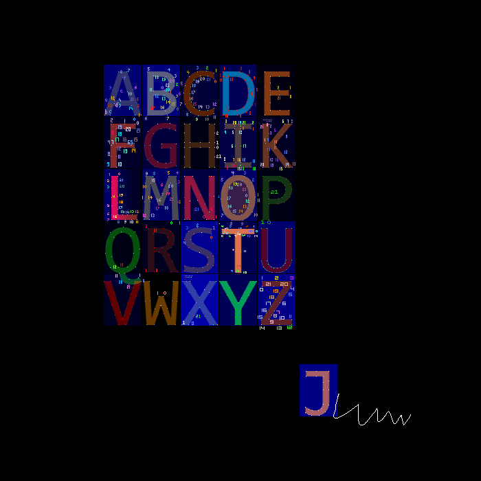
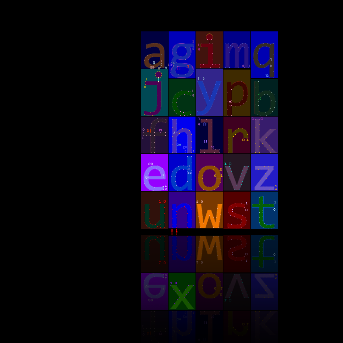
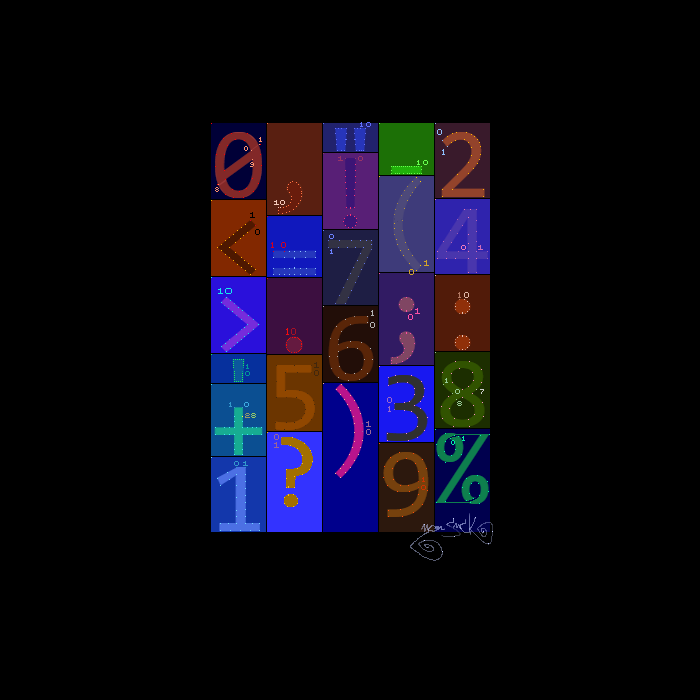

*Y*eaa Ok some project about font animations. You can check the video.

{Ok} lower letters, checked; and now there are some event listeners attached to the arrow keys, to go back and forth between the lines.

