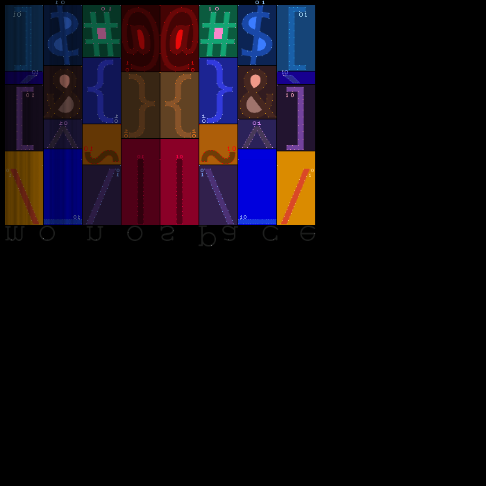

*Y*eaa Ok some project about font animations. You can check the video.


{Ok} lower letters, checked; and now there are some event listeners attached to the arrow keys, to go back and forth between the lines.




This was the m o n o s p a c e font. Have to figure what to do next.

After a long thinking I came with something, you can check the video *Mont3.mkv*, if you want to.
The program is in dev mode so if you want to try it, you need *npm* cos it uses ***vite + React***,
then move to *Mont* subdirectory and type:
```bash
> npm install
> npm run dev
```
, but the program is very buggy:)
